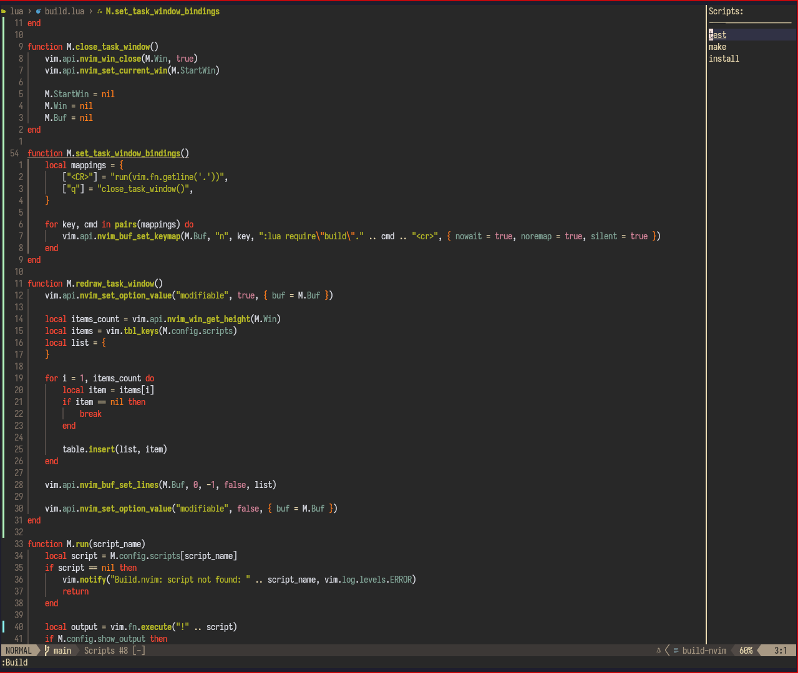

# Build.nvim
A simple script runner plugin and menu for neovim.

## Quick Start
In your neovim configuration file, add the following repository to your packages (lazy.nvim example):
```lua
{
    "gloggers99/build.nvim",
    opts = {
        scripts = {
            -- add your scripts here, these are some examples
            build = "make",
            install = "sudo make install"
        }
    }
}
```
Then you can run your scripts easily using the `BuildRun` command, for example:
```lua
:BuildRun build
```
Or
```lua
:BuildRun install
```
## Build.json file
You can also add a `build.json` file to your project root, for example:
```json
{
    "test": "echo \"Hello world\""
}
```
Everything there will be extended into the configuration for build.nvim and can be executed using the :BuildRun command.
## Keybinding
You can also add keybindings to your configuration file, for example:
```lua
vim.api.nvim_set_keymap('n', '<leader>b', ':BuildRun build<CR>', { noremap = true })
vim.api.nvim_set_keymap('n', '<leader>i', ':BuildRun install<CR>', { noremap = true })
```
